**Product Management REST API**

A Spring Boot RESTful API for managing products with CRUD operations, soft deletion, pagination, sorting, validation, and Basic Authentication.
This project demonstrates clean architecture, service layering, reusable utilities, centralized constants, and detailed API documentation with Swagger UI.

**What This Project Uses**

    Core Technologies

        ✔ Java 17
        ✔ Spring Boot 3
        ✔ Spring Web
        ✔ Spring Data JPA
        ✔ Spring Security (Basic Auth)
        ✔ MySQL
        ✔ Lombok
        ✔ Swagger

**Features**

    ✔ Create, Update, Fetch & Soft Delete Products
    ✔ Pagination & Sorting (Dynamic)
    ✔ Input Validation using Jakarta Validation
    ✔ Global Exception Handling
    ✔ Basic Authentication with Role-Based Access
    ✔ Clean, Layered Architecture
    ✔ Swagger UI for API Documentation
    ✔ MySQL Support
    ✔ Standard API & Error Response Format

**How It Works (Project Internals)**

    1. Product Entity

        ✔ Uses UUID ID generation
        ✔ Includes soft delete using isDeleted = false
        ✔ Mapped with JPA annotations

    2. Validation Layer

    Using @NotBlank, @Size, @DecimalMin, @NotNull:

        ✔ Ensures product name is 2–100 chars
        ✔ Price > 0
        ✔ Description max 500 chars

   3. Service Layer

    The ProductServiceImpl handles:

        ✔ Duplicate name validation
        ✔ Soft delete
        ✔ Pagination using a shared utility
        ✔ Convert entity → DTO
        ✔ Centralized response building

    4. Pagination Logic

    PaginationRequest + AppUtils.buildPageableRequest() provide:

        ✔ Dynamic sorting
        ✔ Dynamic sort key validation
        ✔ Page number + page size handling

    5. Security Layer

   Using Basic Authentication with in-memory users:

         Username	   Password	   Role
         admin	      admin123	   ADMIN
         user	      user123	   USER
        
        ✔ USER → read-only
        ✔ ADMIN → full CRUD

    6. Exception Handling
    
    Global exception handler returns:

        ✔ Standard error format
        ✔ Timestamp
        ✔ Status code + message
        ✔ Project Structure

**Project Structure**

**Authentication (Basic Auth)**

**Add Basic Auth before calling any API:**

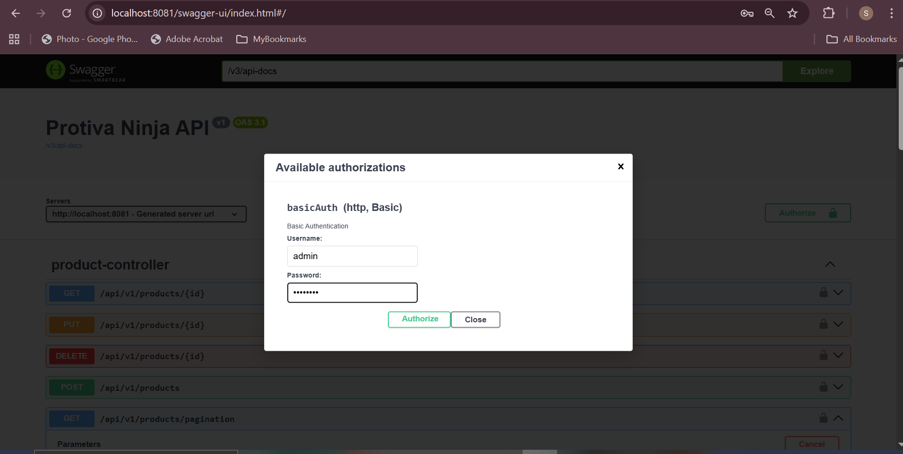

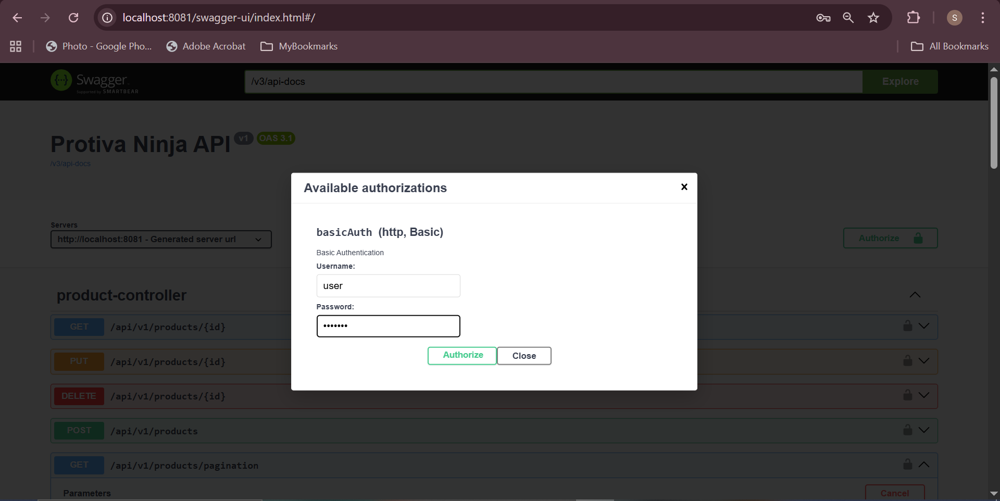

**API Documentation (Swagger UI)**

**Run the application → open browser:**

👉 http://localhost:8081/swagger-ui/index.html

**There you will see:**

✔ All API endpoints

✔ Request bodies

✔ Responses

✔ Authorization button

**Swagger UI Screenshots Section**

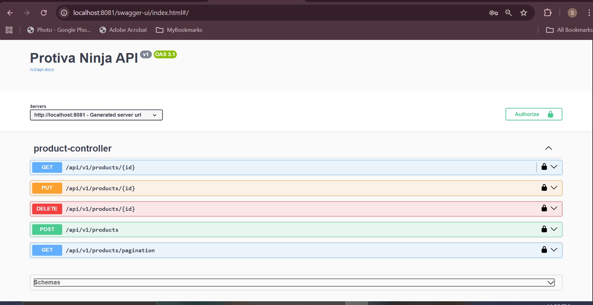

**Screenshots (Swagger UI + API Results)**

**Swagger UI Overview:**

**1. Create Product – Request & Response**

   
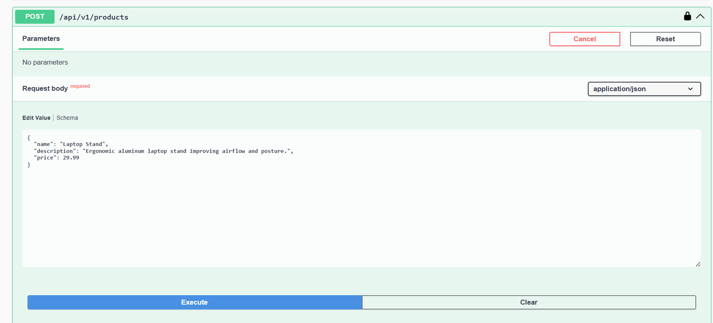

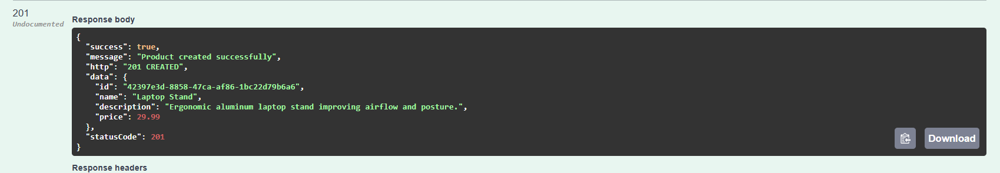

    
**2. Get Product By ID**

   
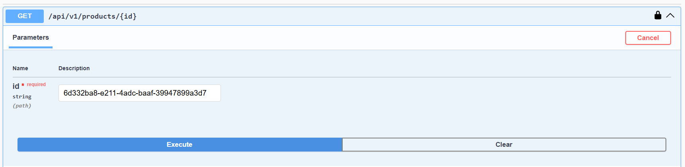

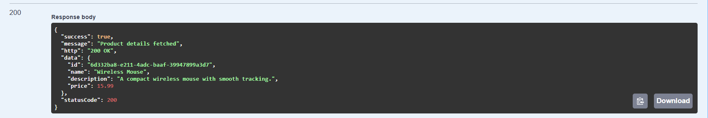

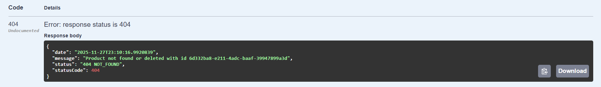

**3. Pagination & Sorting Response**
   
 
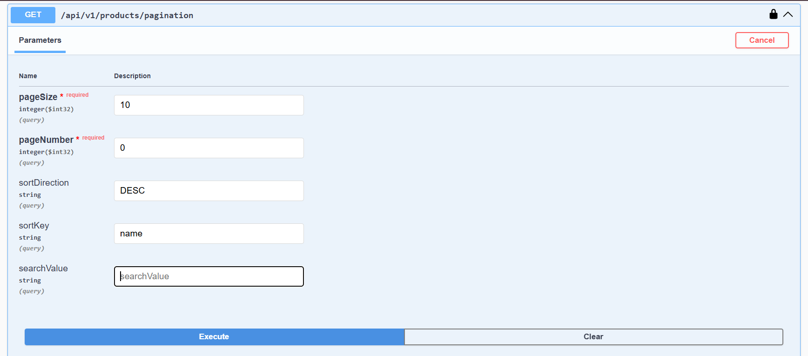

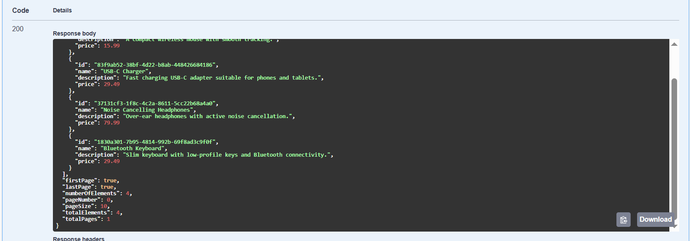

    
**4. Soft Delete Product**

 
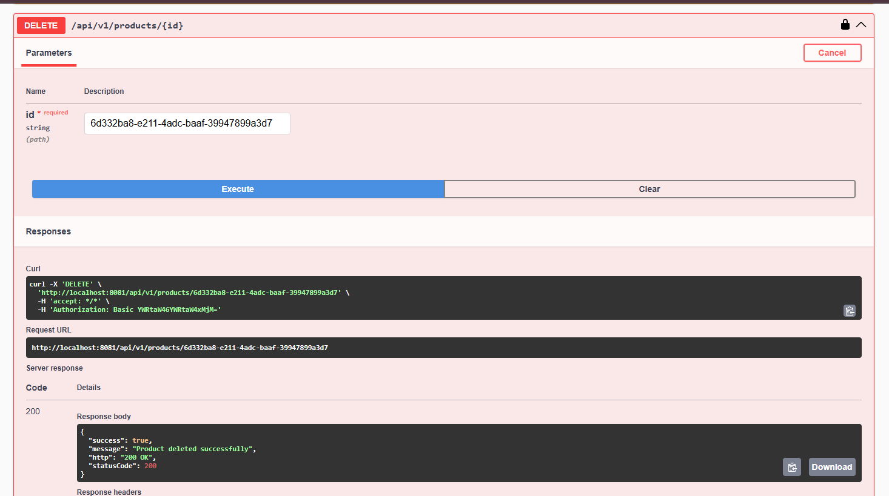

    
**5. Update Product**

   
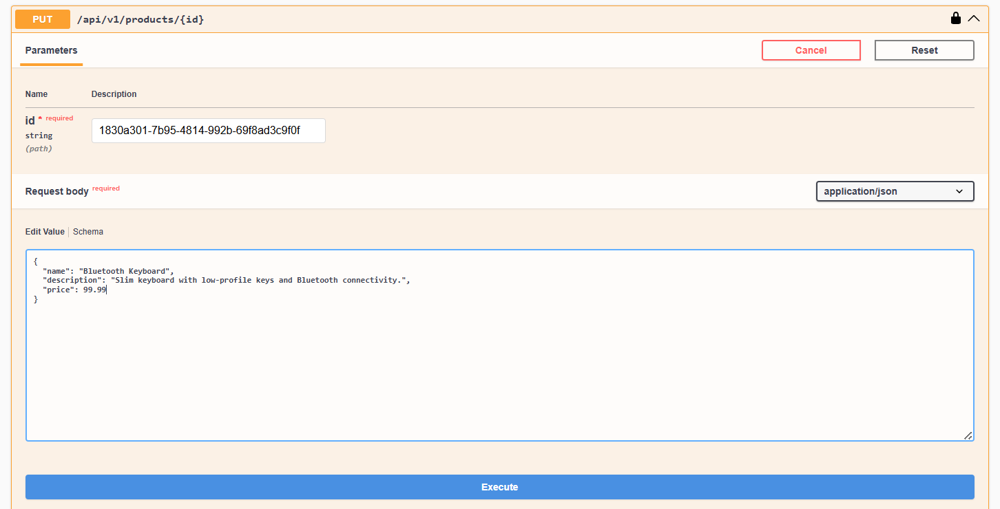

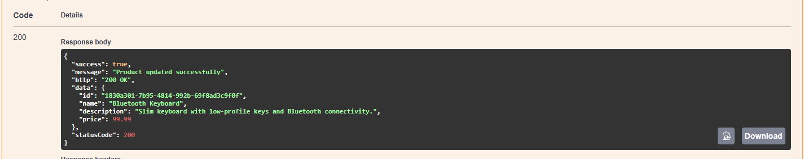

**Highlights**

    ✔ Clean layered architecture
    ✔ Uses DTOs for request & response
    ✔ Centralized constants for messages
    ✔ Soft delete implemented
    ✔ Standard API response format
    ✔ Pagination built with reusable utility
    ✔ Basic Authentication with RBAC
    ✔ Fully documented using Swagger

**Author**

**Sanjana Chouhan**

**Java Backend Developer**
